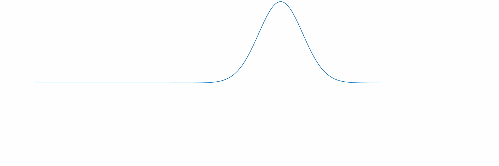

<h1 align="center">Quantum Acorn</h1>

<h4 align="center">
  <a href="https://github.com/tjira/acorn#features">Features</a>
  ·
  <a href="https://github.com/tjira/acorn#compilation">Compilation</a>
  ·
  <a href="https://github.com/tjira/acorn#examples">Examples</a>
  ·
  <a href="https://tjira.github.io/acorn/">Docs</a>
</h4>

<p align="center">
    <a href="https://github.com/tjira/acorn/pulse">
        
    </a>
    <a href="https://github.com/tjira/acorn/blob/master/LICENSE.md">
        
    </a>
    <a href="https://github.com/tjira/acorn/actions/workflows/test.yml">
        
    </a>
    <a href="https://github.com/tjira/acorn/stargazers">
        
    </a>
    <br>
    <a href="https://github.com/tjira/acorn">
        
    </a>
    <a href="https://github.com/tjira/acorn/releases/latest">
        
    </a>
    <a href="https://github.com/tjira/acorn/releases/latest">
        
    </a>
</p>

<p align="center">
Quantum Acorn, a collection of electronic structure methods compiled into a dependency-free binary. If you are here for the educational scripts, you can find them in the education folder.
</p>

## Features

Below are all the important features of Acorn divided into categories.

### Quantum Mechanical Methods

* Numerically Exact Adiabatic & Nonadiabatic Quantum Dynamics with Arbitrary Number of States & Dimensions
* Restricted Hartree–Fock Method, Møller–Plesset Perturbation Theory & Configuration Interaction Methods

## Compilation

Since the software is coded in zig, you need to have the zig compiler installed on your system. You can download the latest version of the zig compiler from the [official website](https://ziglang.org/download). After you have installed the zig compiler, navigate to the project root and run the following command to compile the project.

```bash
zig build --release=fast --summary all
```

This will compile the project and create a binary file named `acorn` in the `zig-out/arch-os` folder, where `arch` is the architecture of your system and `os` is the operating system you are using. If you don't know your CPU architecture, you probably want the `x86_64` binary. You can also perform tests on the project by running the following command.

```bash
zig build --release=fast --summary all test
```

If some tests fail, let me know by creating an issue. If all the tests pass, you can run the binary file using the following command.

```bash
./zig-out/arch-os/acorn
```

You should see the version of the compiler and execution time of the program. If you see this, the program is working correctly.

## Examples

Below are some examples of the quantum mechanical methods implemented in Acorn.

### Real Time Quantum Dynamics


